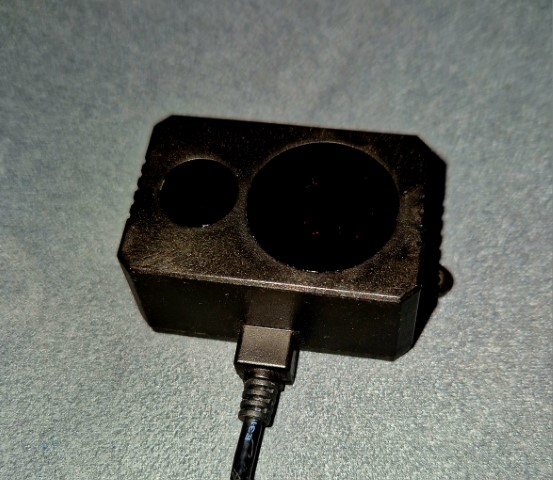

# Lidar Speed Detector

Python script to calculate speed of a moving object using a lidar sensor.

## Benewake TF02 Lidar sensor


## Pre-reqs

You'll need a the following:

- Lidar sensor eg. Benewake TF02
- USB-TTL Serial converter adapter
- PC or Raspberry Pi
- Docker for devcontainer support
- WSL 2

## Development with devcontainers

Devcontainers make the setup of the Python environment easy for debugging the script.  

### WSL 2 Serial port access

In order to read the lidar sensor data, we'll be doing this over the serial port.  Replace the `ttyUSB0` with the relevant port of your device.

1. Attach the sensor via USB-TTL adapter
1. Expose the [USB device to the WSL 2 environment](https://learn.microsoft.com/en-us/windows/wsl/connect-usb)
1. Within PowerShell list the available USB devices and attach the relevant sensor device id to wls

    ```Powershell
        usbipd wsl list
        usbipd wsl attach --busid 1-1
    ```

1. Expose USB device access inside the devcontainer, within [devcontainer.json#L16](.devcontainer/devcontainer.json)

    ```json
        "runArgs": ["--device=/dev/ttyUSB0"],
    ```

### Debugging

Once the serial device is setup, within the devcontainer you should be able to F5 on main.py, which will start to read sensor data and calculate speed based on the distance readings from the lidar.

When debugging if you see:

    `[Errno 13] could not open port /dev/ttyUSB0: [Errno 13] Permission denied: '/dev/ttyUSB0'`

Whilst trying to open the port eg:

```python
    ser = serial.Serial('/dev/ttyUSB0', 115200, timeout = 1)
```

You may need to grant read/write/execute permissions to the USB port eg:

```bash
    sudo chmod +777 /dev/ttyUSB0
```

When running when lidar detects movement you should see output in the console eg:

```
18:00:20.99 Speed: 33.12 kmh Distance: 46 cms Current: 122 cm Max: 168 cm Min: 122 cm Datapoints: 5 
18:00:21.04 Speed: 39.6 kmh Distance: 55 cms Current: 44 cm Max: 99 cm Min: 44 cm Datapoints: 5 
18:00:21.09 Speed: 12.96 kmh Distance: 18 cms Current: 27 cm Max: 36 cm Min: 18 cm Datapoints: 5 
18:00:21.14 Speed: 48.24 kmh Distance: 67 cms Current: 118 cm Max: 118 cm Min: 51 cm Datapoints: 5 
18:00:21.20 Speed: 41.76 kmh Distance: 58 cms Current: 74 cm Max: 132 cm Min: 74 cm Datapoints: 5 
18:00:21.25 Speed: 18.0 kmh Distance: 25 cms Current: 36 cm Max: 61 cm Min: 36 cm Datapoints: 5 
18:00:21.30 Speed: 44.64 kmh Distance: 62 cms Current: 123 cm Max: 123 cm Min: 61 cm Datapoints: 5 
18:00:21.35 Speed: 15.12 kmh Distance: 21 cms Current: 153 cm Max: 153 cm Min: 132 cm Datapoints: 5 
18:00:21.40 Speed: 5.04 kmh Distance: 7 cms Current: 163 cm Max: 163 cm Min: 156 cm Datapoints: 5 
18:00:21.45 Speed: 2.88 kmh Distance: 4 cms Current: 168 cm Max: 168 cm Min: 164 cm Datapoints: 5 
 _____              _  _    ___   ____  _  _     _              _     
|_   _|__  _ __ _  | || |  ( _ ) |___ \| || |   | | ___ __ ___ | |__  
  | |/ _ \| '_ (_) | || |_ / _ \   __) | || |_  | |/ / '_ ` _ \| '_ \ 
  | | (_) | |_) |  |__   _| (_) | / __/|__   _| |   <| | | | | | | | |
  |_|\___/| .__(_)    |_|  \___(_)_____|  |_|   |_|\_\_| |_| |_|_| |_|
          |_|                                                         
    _                 ____   __    _ _  _     _              _     
   / \__   ____ _ _  |___ \ / /_  / | || |   | | ___ __ ___ | |__  
  / _ \ \ / / _` (_)   __) | '_ \ | | || |_  | |/ / '_ ` _ \| '_ \ 
 / ___ \ V / (_| |_   / __/| (_) || |__   _| |   <| | | | | | | | |
/_/   \_\_/ \__, (_) |_____|\___(_)_|  |_|   |_|\_\_| |_| |_|_| |_|
            |___/                                                  
```